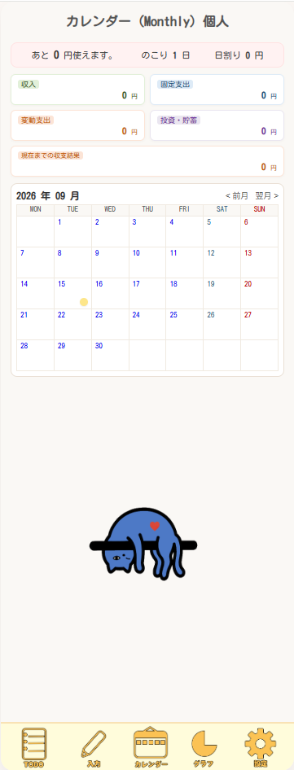
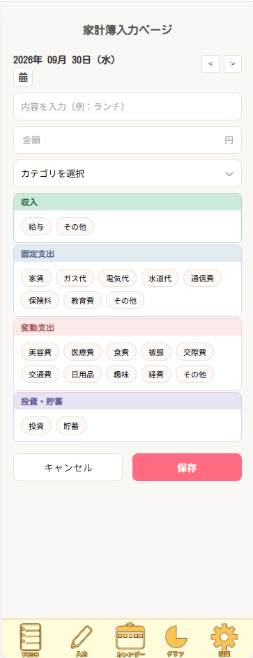
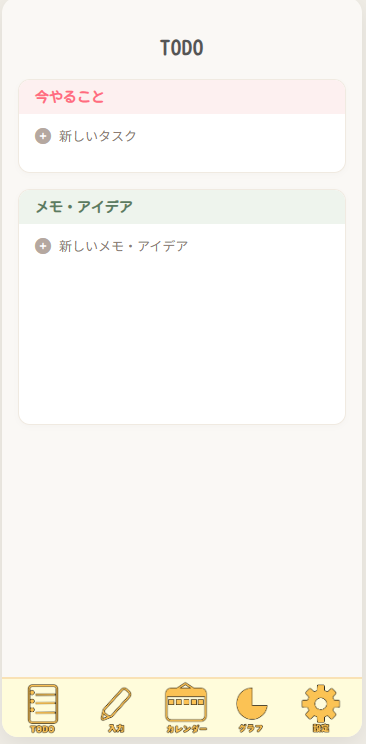
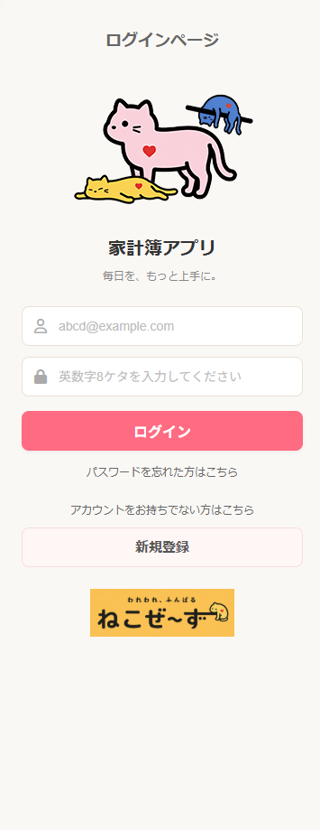
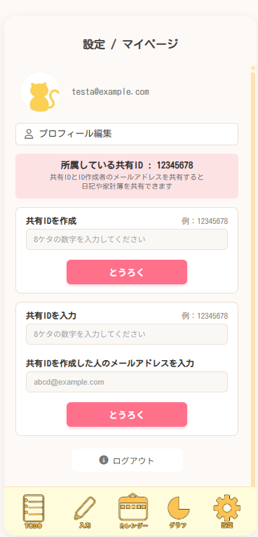
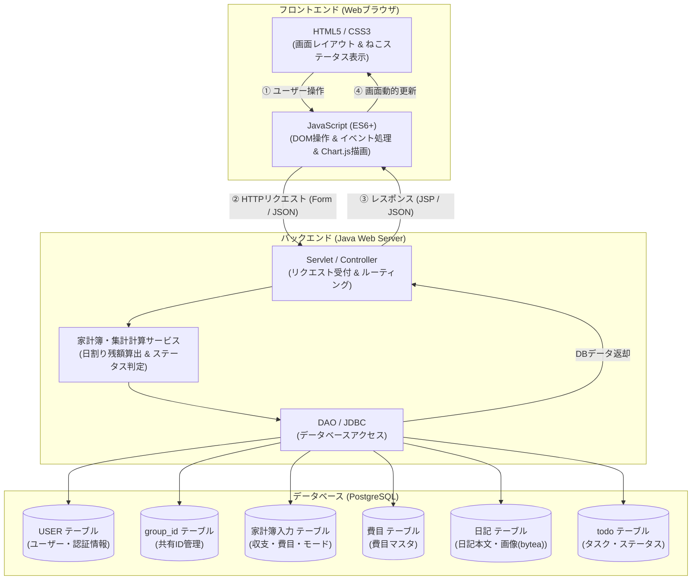

# アプリケーション「ねこぜ家計簿」

[](https://openjdk.org/)
[](https://tomcat.apache.org/)
[](https://www.postgresql.org/)
[](https://developer.mozilla.org/ja/docs/Web/JavaScript)
[](https://www.eclipse.org/)
[](https://a5m2.mmatsubara.com/)
[](https://antigravity.google/)

日々の家計管理（収支記録・予算算出）、TODOタスク管理、および写真付き日記機能を統合したWebアプリケーションです。  
当月の予算使用状況や日割り可能額を可視化し、予算消化率（本日使用率）に応じてステータス画像（「寝そべり」「姿勢良い」「猫背」）の表示が動的に変化するユニークな機能を搭載しています。個人の管理に加え、8桁の共有IDを用いたグループ共有機能にも対応しています。

> [!NOTE]  
> **本プロジェクトは、Java実習時に作成したWebアプリケーション（ポートフォリオ）です。**  
> * **開発期間**: 26日  (要件定義、PD、PG)
> * **開発規模**: 2.8Kstep  
> 
> Java実習の内容は以下よりご覧いただけます。  
> 👉 **[Java実習の内容はこちら](https://github.com/hadano-nobuyuki/ai-programming-training-portfolio)**  
> *(※別タブで開く場合は Ctrl + クリック / Cmd + クリック 推奨)*

---

## 📑 目次
1. [💻 画面イメージ](#-画面イメージ)
2. [✨ 主な機能](#-主な機能)
3. [🧰 使用技術・開発環境](#-使用技術開発環境)
4. [📐 システム構成](#-システム構成)
5. [🗄️ データベース設計](#️-データベース設計)
6. [🛠️ ローカル環境での実行・セットアップ手順](#️-ローカル環境での実行セットアップ手順)
7. [💡 工夫した点・計算ロジック仕様](#-工夫した点計算ロジック仕様)

---

## 💻 画面イメージ

*(※ 掲載している画像はシステム画面の一部抜粋です。全画面イメージや詳細な画面フローは [要件定義書・画面設計書](#-要件定義書画面設計書) よりご覧いただけます)*

| カレンダー(Monthly)個人 (`calendar-monthly-private.jsp`) | 家計簿入力ページ (`input.jsp`) |
| :---: | :---: |
|  |  |
| 当月残額・本日利用可能額（日割り）およびねこステータス表示 | 収支金額・支出種別・全22費目・メモの登録フォーム |

| TODO画面 (`todo.jsp`) | 月支出ページ(個人) (`graph-monthly-private.jsp`) |
| :---: | :---: |
|  |  |
| 今日やること・買い物リストの完了チェック＆打消し線表示 | 費目別・カテゴリー別グラフィック集計表示 |

| ログイン画面 (`login.jsp`) | 設定画面 (`setting.jsp`) |
| :---: | :---: |
|  |  |
| メールアドレス・パスワード認証および伏字切替（目アイコン） | 共有ID作成・照合認証およびログアウトダイアログ |

### 🐱 ねこステータス（予算使用率に応じた動的GIF表示）
予算使用率に応じて、モチベーションを高めるアニメーションGIFアイコンが動的に切り替わります。

| 良い（0% 〜 70% 未満） | 普通（70% 〜 100% 以下） | 悪い（100% 超・予算オーバー） |
| :---: | :---: | :---: |
|  |  |  |
| 計画通りの節約ペース「寝そべりねこ」 | 順調な予算消化「姿勢が良いねこ」 | 予算オーバー注意「猫背ねこ」 |

---

## ✨ 主な機能

* 🐱 **モチベーション連動型 家計簿・予算管理（ねこステータス）**
  * 当月利用可能残額および本日利用可能額（日割り残額）の動的リアルタイム計算
  * 本日使用率に応じたねこアイコンの段階判定・動的GIF切替（寝そべり / 姿勢良い / 猫背）
* 📅 **カレンダー & 写真付き日記機能**
  * 個人/共有それぞれの月次（Monthly）・日次（Day）カレンダー表示
  * 日次画面における収支明細確認・編集および写真付き日記の登録・閲覧（bytea保存）
* 📝 **TODO・タスク管理**
  * 今日やること・買い物リスト・アイデアの追加・編集・削除
  * チェックボックス操作による完了ステータス切り替え（グレーアウト＋打消し線表示）
* 📊 **多角的な支出可視化グラフ**
  * 年・月・日の3つの時間軸 × 個人/共有の2モード（計6パターン）での集計
  * 固定支出・変動支出・投資貯蓄の割合および費目別内訳をグラフィカルに可視化
* 👥 **共有グループ機能（共有ID）**
  * 8桁の共有IDによるグループ作成・照合認証
  * グループメンバー間での共有家計簿データの閲覧およびユーザーごとの収支内訳表示
* 🔐 **ユーザー認証・アカウント管理**
  * ユーザー登録（8色のアイコン選択、メール重複チェック、秘密の質問設定）
  * ログイン・ログアウト（セッション管理）
  * 秘密の質問によるパスワード再設定機能
  * パスワードおよび秘密の質問回答の安全なハッシュ化保存（BCrypt）

---

## 🧰 使用技術・開発環境

| カテゴリ | 技術スタック / 仕様 |
| :--- | :--- |
| **開発期間** | 26日 |
| **開発規模** | 2.8Kstep |
| **言語・ランタイム** | Java 25 (OpenJDK) |
| **Webコンテナ / APサーバ** | Apache Tomcat 11 |
| **バックエンドフレームワーク** | Java (Servlet / JSP / MVC) |
| **データベース** | PostgreSQL 18.1（テーブル生成・データ投入用[create_tables.sql](create_sql)を同梱） |
| **インフラ / ホスティング** | AWS (EC2) |
| **統合開発環境 (IDE)** | Eclipse |
| **DB管理・設計ツール** | A5:SQL Mk-2 |
| **開発支援（AI）** | Antigravity |

---

## 📐 システム構成



---
## 🌐 動作確認（デモ環境）

AWS上にデプロイしており、実際に動作をご確認いただけます。

👉 **[「ねこぜ家計簿」デモサイトはこちら](http://13.193.142.78/neko)**  
*(※別タブで開く場合は `Ctrl + クリック` / `Cmd + クリック` 推奨)*

> **テスト用ログイン情報**  
> * **ID**: `guest_user@example.com`  
> * **パスワード**: `password123`

---

## 📖 要件定義書・画面設計書

👉 **[Web版 要件定義書・画面設計書はこちら（GitHub Pages）](https://hadano-nobuyuki.github.io/project/)**  
*(※リンクを別タブで開く場合は `Ctrl + クリック`（Macは `Cmd + クリック`）してください)*  
*(※システム仕様・各画面イメージ・業務フローの詳細をWebページ形式でご覧いただけます)*

---

## 🛠️ ローカル環境での実行・セットアップ手順

ローカル環境で本プロジェクトを実行する手順です。

ローカル環境で本プロジェクトを実行する場合は、以下の環境準備、データベースのセットアップおよびデータベース接続設定が必要です。

### 1. 前提条件
* **Java**: JDK25
* **Webコンテナ / APサーバー**: Apache Tomcat 11
* **データベース**: PostgreSQL 18.1
  * ※ プログラムを実行する際に必要な環境として、データベースのテーブル生成用DDL（[`create_tables.sql`](create_tables.sql)）をプロジェクトルート直下に公開・同梱しています。

### 2. データベースのセットアップ
1. PostgreSQLにて任意名のデータベースを作成します（例: `nekozebudget`）。
2. 作成したデータベースに対して、プロジェクトルート直下の [`create_tables.sql`](create_tables.sql) を実行してテーブルを作成します。  
   *(※ A5:SQL Mk-2、pgAdmin、または `psql` コマンドライン等から実行可能です)*

### 3. データベース設定ファイルの作成
セキュリティ保護のため設定ファイル自体はリポジトリ管理外となっています。  
`/src/main/java/` 配下に `db.properties` を作成し、ご自身のローカルDB環境に合わせて接続情報を設定してください。

> **リポジトリ内に `db.properties.sample` を用意していますので、リネームしてご利用いただけます。**

#### `db.properties` の記述例
```properties
db.url=jdbc:postgresql://localhost:5432/データベース名
db.user=ユーザ名
db.password=パスワード
db.driver=org.postgresql.Driver
```
---

## 💡 工夫した点

### 1. 直感的なUI・UX設計
* **モバイルでも使用する想定のボトムナビゲーションバー**: 下部固定のボトムナビゲーションバーにより、スマートフォン操作でも直感的かつスムーズな画面切り替えを実現しました。
* **インタラクティブなタスク管理**: TODOの完了時におけるグレーアウト＆打ち消し線表示、支出した各費目のグラフ描画、予算使用状況によるねこステータスの変化など、使っていて楽しくなる視覚効果を追求しました。

### 2. 本日利用可能額（日割り残額）とねこステータス画像の表示判定
ユーザーが無理なく節約を続けられるよう、当月の残り日数と支出状況に応じた動的計算を行っています。

* **残り使用可能額**:
  $$\text{残り使用可能額} = \text{当月収入} - (\text{当月固定支出} + \text{当月変動支出} + \text{当月投資・貯蓄})$$
* **当月残日数**: 本日（システム日付）から当月末日までの日数（本日を含む）
* **日割り残額**:
  $$\text{日割り残額} = \frac{\text{残り使用可能額}}{\text{当月残日数}} \quad (\text{円未満切り捨て})$$

* **ねこステータス判定（本日使用率）**:
  1. 基準値 = $\frac{\text{当月収入} - \text{固定支出} - \text{投資・貯蓄}}{\text{当月日数}}$
  2. 本日使用率 = $\frac{\text{日割り残額}}{\text{基準値}}$
  3. ステータス判定:
     * `0% 〜 70% 未満` ➔ **良い** (`nesoberi.gif`)
     * `70% 〜 100% 以下` ➔ **普通** (`siseiyoi.gif`)
     * `100% 超（予算オーバー）` ➔ **悪い** (`nekoze.gif`)


---

## 🧗 苦労した点・得られた教訓

### AI生成プログラムにおける品質とプロンプトの最適化
プログラム設計書の書き方やプロンプトの指示内容によって、生成されるコーディングの品質に大きなばらつきが生じました。特にif-else文などの条件分岐では、ロジックが途中で破綻したり、意図しない実装になったりするケースが多々見られました。


人間にとって分かりやすい記述だけでなく、AIの出力特性や解釈を考慮した仕様書の書き方や指示出しの工夫が不可欠であると身をもって学びました。

この経験から、以下の教訓を得ることができました。

1. **条件分岐（if-elseなど）のロジックが確実に網羅されるためのプロンプト指示の工夫**
2. **人間視点だけではなく「AIの出力」を最適化する仕様の言語化・言語表現の重要性**

これらの教訓は、今後のAIを活用した開発プロセスにおいて、役立てていける知見であると考えています。